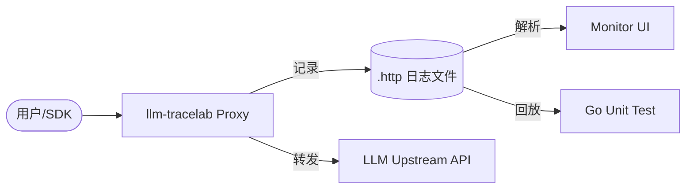

# llm-tracelab

[](https://golang.org)
[](./LICENSE)
[](https://github.com/kingfs/llm-tracelab/actions/workflows/ci.yml)

[English Version](./README_EN.md) | **中文说明**

`llm-tracelab` 是一个专为大语言模型（LLM）API 设计的记录与回放工具。它的初衷是将会话请求录制为本地 `.http` 文件，并将其作为单元测试的输入，同时提供了一个简单的 Web UI 用于可视化查看。

---

## 📖 核心特性

- 🚀 **零侵入记录**：作为代理运行，透明拦截并记录所有 LLM API 请求。
- 📦 **标准格式**：记录为带有元数据的准 HTTP 报文格式（`.http`），方便二次处理。
- 🧪 **单元测试友好**：参考 `httprr` 思路，提供 `replay.Transport`，可轻松将录制的文件作为测试 Mock 输入。
- 🖥️ **内置可视化**：内置简单的 Monitor Dashboard，直观展示请求详情、Token 消耗、TTFT 等指标。
- 🎭 **混沌工程**：支持按概率注入延迟或错误，用于测试生产环境的异常处理。

## 🏗️ 项目架构



## 🚀 快速开始

### 1. 安装 (二进制)
```bash
go build -o llm-tracelab ./cmd/server
```

### 2. Docker
你可以直接使用 Docker 镜像：
```bash
docker pull kingfs/llm-tracelab:latest
docker run -d -p 8080:8080 -p 8081:8081 -v ./config:/app/config kingfs/llm-tracelab:latest
```

### 3. 配置
编辑 `config/config.yaml`：
```yaml
server:
  port: "8080"      # 代理端口
monitor:
  port: "8081"      # 看板端口
upstream:
  base_url: "https://api.openai.com"
  api_key: "your-api-key"
```

### 3. 运行
```bash
./llm-tracelab -c config/config.yaml
```

将你的 SDK BaseURL 指向 `http://localhost:8080` 即可开始记录。

## 🧪 单元测试回放

你可以使用录制好的 `.http` 文件在没有网络的情况下运行测试：

```go
func TestChat(t *testing.T) {
    // 使用录制的文件初始化回放 Transport
    tr := replay.NewTransport("testdata/chat.http")
    
    config := openai.DefaultConfig("fake-key")
    config.HTTPClient = &http.Client{Transport: tr}
    client := openai.NewClientWithConfig(config)

    resp, err := client.CreateChatCompletion(context.Background(), ...)
    // ... 验证结果
}
```

## 🛠️ 开发进度

- [x] 核心代理逻辑
- [x] SSE 流式解析与 Token 嗅探
- [x] HTTP V2 增强格式录制
- [x] Monitor Dashboard (List & Detail)
- [x] Replay Transport (用于单元测试)
- [x] GitHub Actions CI & Templates
- [ ] 更多模型的适配 (Claude, Gemini 等)

## 📄 开源协议

基于 [MIT License](./LICENSE) 开源。

