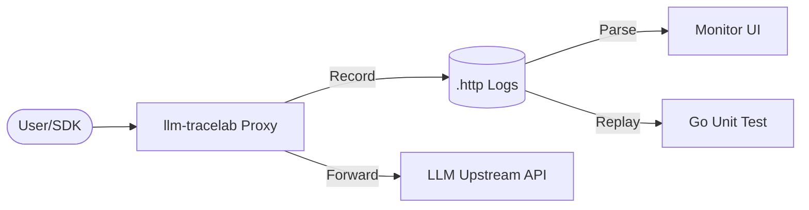

# llm-tracelab

[](https://golang.org)
[](./LICENSE)
[](https://github.com/kingfs/llm-tracelab/actions/workflows/ci.yml)

**English Version** | [中文说明](./README.md)

`llm-tracelab` is a recording and replay tool designed specifically for Large Language Model (LLM) APIs. It records conversation requests into local `.http` files, which can then be used as input for unit tests, while providing a simple Web UI for visualization.

---

## 📖 Key Features

- 🚀 **Non-intrusive Recording**: Runs as a proxy, transparently intercepting and recording all LLM API requests.
- 📦 **Standard Format**: Records in a standard HTTP format (`.http`) with embedded metadata for easy processing.
- 🧪 **Unit Test Friendly**: Inspired by `httprr`, it provides `replay.Transport` to easily use recorded files as mock input.
- 🖥️ **Built-in Visualization**: Includes a simple Monitor Dashboard to display request details, Token usage, TTFT, and more.
- 🎭 **Chaos Engineering**: Supports probabilistic injection of delays or errors to test production robustness.

## 🏗️ Architecture



## 🚀 Quick Start

### 1. Install (Binary)
```bash
go build -o llm-tracelab ./cmd/server
```

### 2. Docker
You can directly use the Docker image:
```bash
docker pull kingfs/llm-tracelab:latest
docker run -d -p 8080:8080 -p 8081:8081 -v ./config:/app/config kingfs/llm-tracelab:latest
```

### 3. Configuration
Edit `config/config.yaml`:
```yaml
server:
  port: "8080"      # Proxy port
monitor:
  port: "8081"      # Dashboard port
upstream:
  base_url: "https://api.openai.com"
  api_key: "your-api-key"
```

### 3. Run
```bash
./llm-tracelab -c config/config.yaml
```

Point your SDK's BaseURL to `http://localhost:8080` to start recording.

## 🧪 Replay in Unit Tests

You can use recorded `.http` files to run tests without network access:

```go
func TestChat(t *testing.T) {
    // Initialize Replay Transport with a recorded file
    tr := replay.NewTransport("testdata/chat.http")
    
    config := openai.DefaultConfig("fake-key")
    config.HTTPClient = &http.Client{Transport: tr}
    client := openai.NewClientWithConfig(config)

    resp, err := client.CreateChatCompletion(context.Background(), ...)
    // ... validate response
}
```

## 🤖 Automation

This project uses GitHub Actions for CI/CD and provides templates for Pull Requests and Issues:
- **CI Workflow**: Automatically builds and tests the project on chaque push/PR.
- **Templates**: Standardized formats for bug reports, feature requests, and PR descriptions.

## 📄 License

Open source under the [MIT License](./LICENSE)