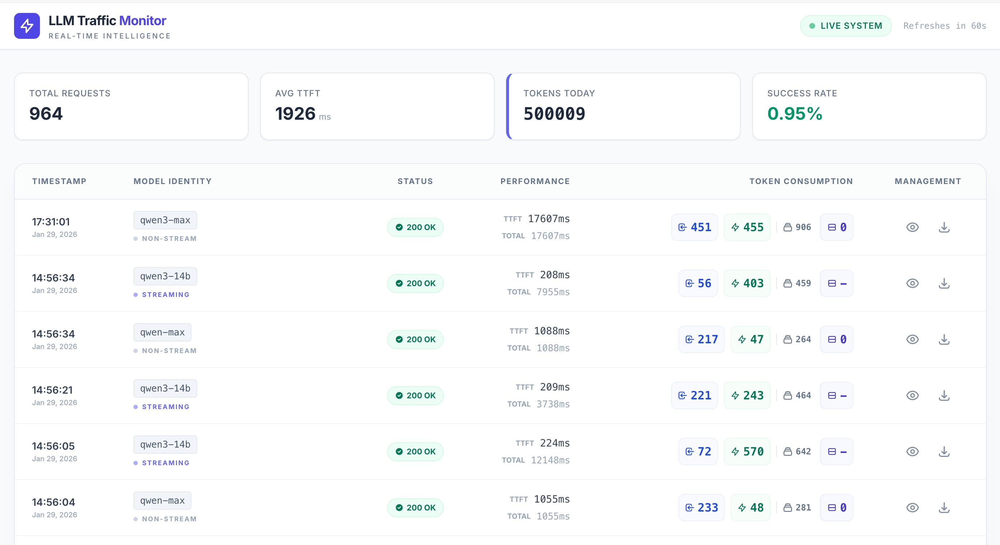
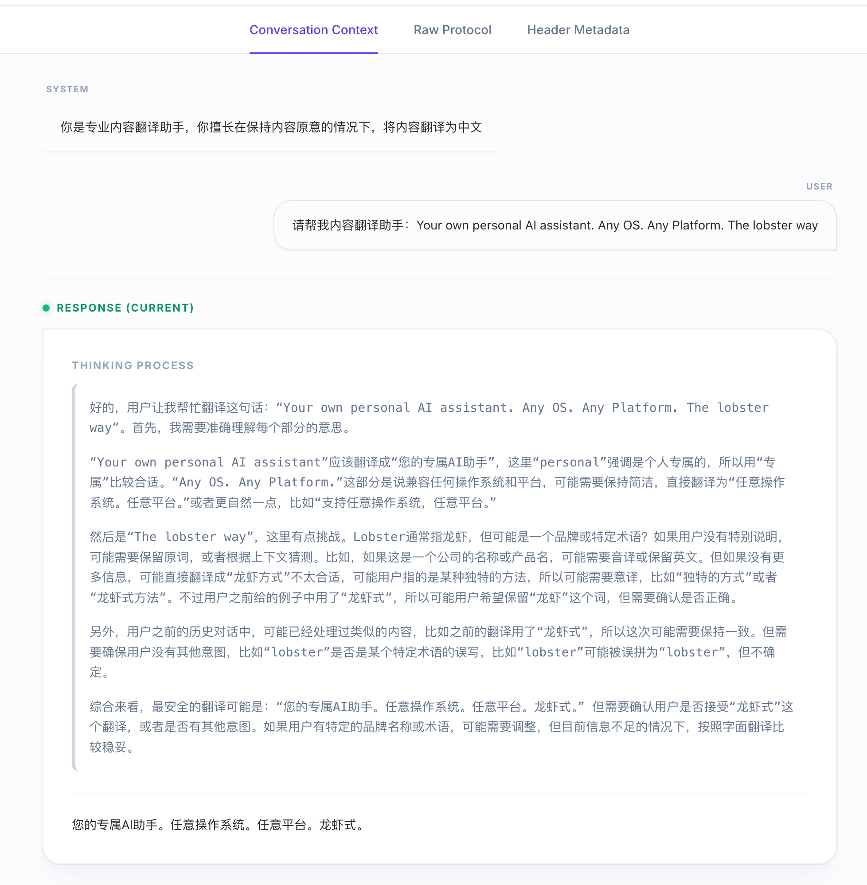
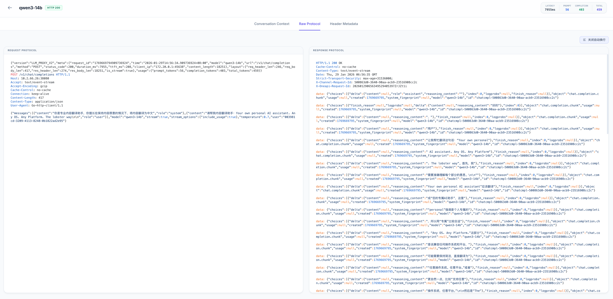
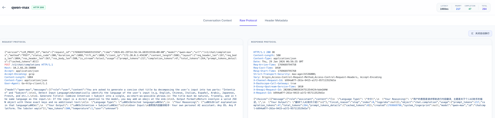

# llm-tracelab

[](https://golang.org)
[](./LICENSE)

[中文说明](./README.md) | **English**

`llm-tracelab` is a local-first record/replay proxy for LLM HTTP APIs. It currently covers OpenAI-compatible, Anthropic Messages, Google GenAI, and Vertex-native protocol families.
The core workflow is simple:

- record real LLM HTTP traffic during development
- replay it in unit tests without calling the upstream model
- get faster, cheaper, and more reliable tests

It is similar in spirit to HTTP record/replay tooling, but tuned for LLM traffic: streaming responses, token usage, trace inspection, and lightweight chaos testing.

## Current Release Notes

This refactor introduces four major changes:

- `pkg/llm` is now a provider/endpoint adapter layer for requests, responses, stream transcripts, and usage pipelines
- the monitor is now an embedded React UI with async pagination and detail views for timeline / summary / raw protocol
- SQLite now exposes stable `trace_id` values instead of path-based monitor URLs
- `LLM_PROXY_V3` `# event:` lines now include `llm.*` provider timelines in addition to base request/response events

## Good Fit

- stable unit tests for SDK or application code
- reproducing prompt, tool-call, or streaming issues
- inspecting latency, TTFT, and token usage
- local proxying and debugging of LLM traffic

## Features

- transparent proxy for OpenAI-compatible requests
- persists each exchange as a local `.http` cassette
- `pkg/replay.Transport` for replay-based unit tests
- monitor UI for request detail, unified timeline, and raw protocol views
- SQLite metadata index for fast list/stat queries
- backward-compatible readers for legacy V2 record files

## Layout

```text
cmd/server            server entrypoint
internal/proxy        reverse proxy and response interception
internal/recorder     cassette recording and persistence
internal/store        SQLite metadata index
internal/monitor      monitor UI and detail parsing
pkg/recordfile        shared V2/V3 record format parser/writer
pkg/replay            replay transport for tests
pkg/llm               cross-provider normalization helpers
```

AI-oriented project guidance lives in [AGENTS.md](./AGENTS.md). The current implemented baseline is summarized in [docs/PROJECT_BASELINE.md](./docs/PROJECT_BASELINE.md). A short technical summary is in [docs/ARCHITECTURE.md](./docs/ARCHITECTURE.md), the upstream compatibility matrix is in [docs/UPSTREAM_PROVIDERS.md](./docs/UPSTREAM_PROVIDERS.md), the project roadmap is in [docs/ROADMAP.md](./docs/ROADMAP.md), and the Vertex family design note is in [docs/VERTEX_NATIVE_PLAN.md](./docs/VERTEX_NATIVE_PLAN.md).

## Record Format And Index

New recordings use `LLM_PROXY_V3`:

1. a compact metadata prelude instead of a fixed 2KB header block
2. full raw HTTP request/response bytes kept for inspection and replay
3. `# event:` lines now capture normalized provider timeline events such as `llm.output_text.delta`, `llm.reasoning.delta`, `llm.tool_call`, and `llm.usage`
4. metadata is indexed into `trace_index.sqlite3` for fast monitor queries

Default storage layout:

```text
logs/
  trace_index.sqlite3
  <upstream-host>/<model>/<yyyy>/<mm>/<dd>/*.http
```

## Quick Start

### 1. Configure

Edit [config/config.yaml](./config/config.yaml):

```yaml
server:
  port: "8080"

monitor:
  port: "8081"

upstream:
  base_url: "https://api.openai.com/v1"
  api_key: "sk-xxx"
  provider_preset: "openai"      # prefer preset-first config
  protocol_family: ""            # leave empty for inference; conflicting preset/family fails fast
  routing_profile: ""            # leave empty for inference; unsupported preset/profile combos fail fast
  api_version: ""                # Azure uses query params; Anthropic uses anthropic-version header
  deployment: ""                 # used by Azure deployment routing
  project: ""                    # used by Vertex project/location routing
  location: ""                   # used by Vertex regional host / path routing
  model_resource: ""             # Vertex model resource such as publishers/google/models/gemini-2.5-flash
  headers: {}                    # extra upstream headers such as anthropic-beta

debug:
  output_dir: "./logs"
  mask_key: false
```

If you prefer starting from a ready-made config, use one of these examples:

- [config/examples/openai.yaml](./config/examples/openai.yaml)
- [config/examples/anthropic.yaml](./config/examples/anthropic.yaml)
- [config/examples/google_genai.yaml](./config/examples/google_genai.yaml)
- [config/examples/azure_openai.yaml](./config/examples/azure_openai.yaml)
- [config/examples/vertex.yaml](./config/examples/vertex.yaml)

Supported environment variable overrides:

- `LLM_TRACELAB_SERVER_PORT`
- `LLM_TRACELAB_MONITOR_PORT`
- `LLM_TRACELAB_UPSTREAM_BASE_URL`
- `LLM_TRACELAB_UPSTREAM_API_KEY`
- `LLM_TRACELAB_UPSTREAM_PROVIDER_PRESET`
- `LLM_TRACELAB_UPSTREAM_PROTOCOL_FAMILY`
- `LLM_TRACELAB_UPSTREAM_ROUTING_PROFILE`
- `LLM_TRACELAB_UPSTREAM_API_VERSION`
- `LLM_TRACELAB_UPSTREAM_DEPLOYMENT`
- `LLM_TRACELAB_UPSTREAM_PROJECT`
- `LLM_TRACELAB_UPSTREAM_LOCATION`
- `LLM_TRACELAB_UPSTREAM_MODEL_RESOURCE`
- `LLM_TRACELAB_OUTPUT_DIR`
- `LLM_TRACELAB_MASK_KEY`

Recommended compatibility pattern:

- OpenAI / OpenRouter / Fireworks / Together / DeepSeek / Groq and similar OpenAI-compatible services: set `provider_preset` plus `base_url`, and make sure `base_url` already includes the upstream API prefix such as `/v1`, `/api/v1`, `/openai`, or `/openai/v1`
- Azure OpenAI `/openai/v1/...`: set `provider_preset: azure` and optionally `api_version`
- Azure deployment-style routing: set `provider_preset: azure` plus `deployment`
- vLLM OpenAI-compatible server: set `provider_preset: vllm`
- Anthropic Messages API: set `provider_preset: anthropic`; use `headers.anthropic-beta` if you need beta features
- Google GenAI API: set `provider_preset: google_genai`; this round supports the base `generateContent` and `streamGenerateContent` flows
- Vertex AI native API: prefer `provider_preset: vertex`; it infers `vertex_express` or `vertex_project_location` from `base_url`

Support level meanings:

- `verified`: backed by direct behavior tests or cassette-level regression coverage
- `compatible`: expected to work under an existing protocol family, but with lighter direct verification
- `planned`: not yet implemented as a preset or not yet supported

Config validation rules:

- `provider_preset`, `protocol_family`, and `routing_profile` are no longer loose independent knobs
- invalid combinations now fail at startup instead of failing later during proxy traffic
- for example, `provider_preset: anthropic` with `protocol_family: google_genai` is rejected
- likewise, `provider_preset: openrouter` with `routing_profile: azure_openai_v1` is rejected

Current recommended support matrix:

- `provider_preset: openai`
  `support: verified`
  `protocol_family: openai_compatible`
  `routing_profile: openai_default`
- `provider_preset: openrouter | fireworks | together | deepseek | groq | moonshot | cerebras | perplexity`
  `support: openrouter/fireworks/together/groq=verified; deepseek/moonshot/cerebras/perplexity=compatible`
  `protocol_family: openai_compatible`
  `routing_profile: openai_default`
- `provider_preset: azure`
  `support: verified`
  `protocol_family: openai_compatible`
  `routing_profile: azure_openai_v1` or `azure_openai_deployment`
- `provider_preset: vllm`
  `support: verified`
  `protocol_family: openai_compatible`
  `routing_profile: vllm_openai`
- `provider_preset: anthropic`
  `support: verified`
  `protocol_family: anthropic_messages`
  `routing_profile: anthropic_default`
- `provider_preset: google_genai | google | gemini`
  `support: verified`
  `protocol_family: google_genai`
  `routing_profile: google_ai_studio`
- `provider_preset: vertex`
  `support: verified`
  `protocol_family: vertex_native`
  `routing_profile: vertex_express | vertex_project_location`
  `notes: controlled preset; covered by adapter / proxy / cassette regressions`

Anthropic example:

```yaml
upstream:
  base_url: "https://api.anthropic.com"
  api_key: "sk-ant-xxx"
  provider_preset: "anthropic"
  api_version: "2023-06-01"
  headers:
    anthropic-beta: "tools-2024-04-04"
```

Google GenAI example:

```yaml
upstream:
  base_url: "https://generativelanguage.googleapis.com"
  api_key: "AIza..."
  provider_preset: "google_genai"
```

Vertex express example:

```yaml
upstream:
  base_url: "https://aiplatform.googleapis.com"
  api_key: "ya29..."
  provider_preset: "vertex"
  model_resource: "publishers/google/models/gemini-2.5-flash"
```

Vertex project/location example:

```yaml
upstream:
  base_url: "https://us-central1-aiplatform.googleapis.com"
  api_key: "ya29..."
  provider_preset: "vertex"
  project: "demo-project"
  location: "us-central1"
  model_resource: "publishers/google/models/gemini-2.5-flash"
```

If you want to avoid presets entirely, explicit config still works:

- `protocol_family: vertex_native`
- `routing_profile: vertex_express | vertex_project_location`

Azure deployment example:

```yaml
upstream:
  base_url: "https://demo-resource.openai.azure.com"
  api_key: "azure-key"
  provider_preset: "azure"
  deployment: "gpt-4o-mini"
  api_version: "2025-03-01-preview"
```

### 2. Build And Run

Using `go-task` is the recommended workflow:

```bash
task build
task run
task migrate
```

Direct run also works:

```bash
go run ./cmd/server -c config/config.yaml
```

Point your SDK `base_url` to `http://localhost:8080/v1` and traffic will be recorded through the proxy.

### 3. Open Monitor

Visit `http://localhost:8081`.

The detail page now has three first-class views:

- `Timeline`: consumes normalized `llm.*` cassette events
- `Summary`: conversation / tools / output block projection
- `Raw Protocol`: side-by-side request/response inspection

## Legacy Migration And SQLite Rebuild

Use the explicit migration command:

```bash
go run ./cmd/server migrate -c config/config.yaml
```

By default it does both:

- rewrites legacy `LLM_PROXY_V2` `.http` cassettes in place to `LLM_PROXY_V3`
- clears and rebuilds `trace_index.sqlite3`

Run only one part if needed:

```bash
go run ./cmd/server migrate -c config/config.yaml -rewrite-v2=false
go run ./cmd/server migrate -c config/config.yaml -rebuild-index=false
```

This is intended for bulk upgrades of old cassette directories and for full SQLite recovery.

## Docker And Compose

The standardized in-container paths are:

- binary: `/app/bin/llm-tracelab`
- config file: `/app/config/config.yaml`
- trace directory: `/app/data/traces`
- SQLite index: `/app/data/traces/trace_index.sqlite3`

The repo now includes:

- [Dockerfile](./Dockerfile)
- [docker-compose.yml](./docker-compose.yml)
- [config/config.docker.yaml](./config/config.docker.yaml)

Start it with:

```bash
export LLM_TRACELAB_UPSTREAM_API_KEY=sk-xxx
docker compose up --build
```

If you only want to use the published Docker Hub image, you can run it directly without cloning the repo:

```bash
docker run --rm \
  -p 8080:8080 \
  -p 8081:8081 \
  -e LLM_TRACELAB_UPSTREAM_BASE_URL=https://api.openai.com/v1 \
  -e LLM_TRACELAB_UPSTREAM_API_KEY=sk-xxx \
  -e LLM_TRACELAB_OUTPUT_DIR=/app/data/traces \
  -e LLM_TRACELAB_SERVER_PORT=8080 \
  -e LLM_TRACELAB_MONITOR_PORT=8081 \
  -v "$(pwd)/docker-data:/app/data" \
  kingfs/llm-tracelab:latest serve -c /app/config/config.yaml
```

If you prefer `docker compose`, you can also reference the Docker Hub image directly:

```yaml
services:
  llm-tracelab:
    image: kingfs/llm-tracelab:latest
    ports:
      - "8080:8080"
      - "8081:8081"
    environment:
      LLM_TRACELAB_UPSTREAM_BASE_URL: https://api.openai.com/v1
      LLM_TRACELAB_UPSTREAM_API_KEY: ${LLM_TRACELAB_UPSTREAM_API_KEY}
      LLM_TRACELAB_OUTPUT_DIR: /app/data/traces
      LLM_TRACELAB_SERVER_PORT: "8080"
      LLM_TRACELAB_MONITOR_PORT: "8081"
    volumes:
      - ./config/config.docker.yaml:/app/config/config.yaml:ro
      - ./docker-data:/app/data
    command: ["serve", "-c", "/app/config/config.yaml"]
```

If the default Go module proxy is slow or blocked in your network, pass `GOPROXY` at build time:

```bash
GOPROXY=https://goproxy.cn,direct docker compose build
```

Default mounts:

- `./config/config.docker.yaml -> /app/config/config.yaml:ro`
- `./docker-data -> /app/data`

The runtime image starts as `root` by default. This avoids common bind-mount permission failures when the host directory owner does not match a fixed in-container UID/GID, such as failing to create `/app/data/traces`.

For external configuration, prefer mounting a config file and overriding runtime values through environment variables. Keep `debug.output_dir` on a stable path inside the mounted data volume.

## Developer Commands

```bash
task fmt
task lint
task test
task build
task run
task migrate
task check
task docker:build
task docker:up
```

## Replay In Unit Tests

```go
func TestChat(t *testing.T) {
    tr := replay.NewTransport("testdata/chat.http")

    cfg := openai.DefaultConfig("fake-key")
    cfg.BaseURL = "http://localhost/v1"
    cfg.HTTPClient = &http.Client{Transport: tr}

    client := openai.NewClientWithConfig(cfg)
    resp, err := client.CreateChatCompletion(context.Background(), req)
    _ = resp
    _ = err
}
```

## Design Rules

- raw `.http` cassettes are the source of truth for replay
- SQLite is a metadata index, not a replacement for raw files
- new writes use V3, old V2 files remain readable
- prefer readable files, offline tests, and local-first workflows
- provider semantics, stream transcripts, usage, and event timelines should converge inside `pkg/llm`

## Screenshots

- Monitor overview
  
- Detail page
  
- Raw SSE stream
  
- Non-stream response
  

## License

[MIT](./LICENSE)
